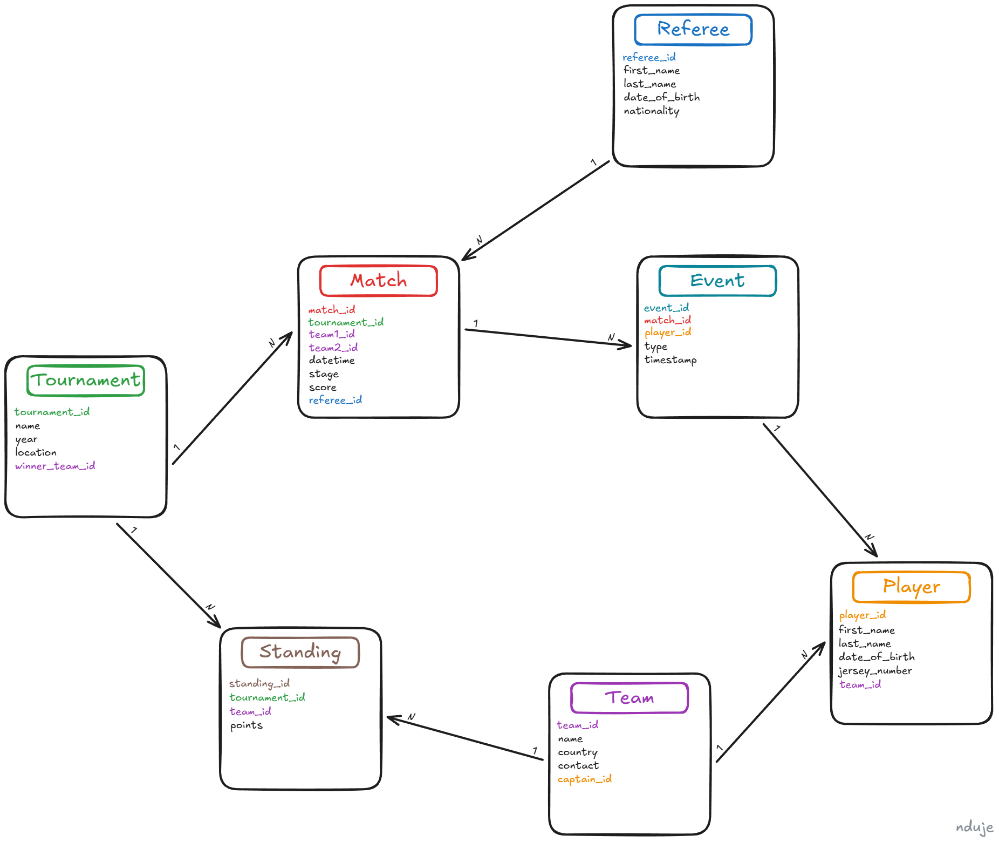

# Sports Tournament Database

### DUMP Internship: Week 6 - SQL2

## Task

This project represents a database for organizing and tracking sports tournaments, allowing storage of all relevant information about tournaments, teams, matches, and players.  
The database includes entities such as Tournament, Team, Player, Referee, Match, Event, and Standing (for team rankings and points), along with their relationships, enabling:

- Tracking teams and their participation in tournaments
- Recording all matches and events (goals, cards)
- Analyzing team and player statistics
- Determining tournament winners and leaderboard standings

## ERD

The project contains an ERD diagram that visually displays all database entities, their attributes, and the relationships between them.  

## Database Setup Order

1. enums
2. tables
3. constraints
4. functions
5. triggers
6. indexes
7. seeds
   7.1 seed tournaments
   7.2 seed teams
   7.3 seed players
   7.4 seed referees
   7.5 seed standings
   7.6 seed match_types
   7.7 seed matches
   7.8 seed events
8. queries
